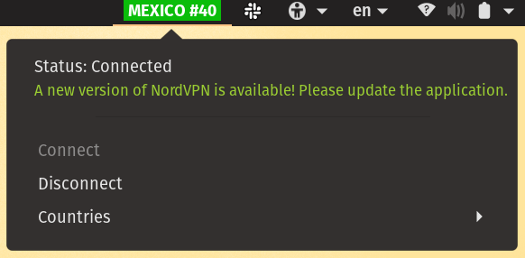

# gNordVPN-Local

A Gnome extension that shows the NordVPN status in the top bar, features a menu showing the current status and a button to Connect / Disconnect, in addition to other functionality.

###### Note
**Forked from: https://github.com /ThatRobVK/NordVPN-Local
TheRobVK version is awesome but does not seem to be active anymore, this repo is just continuing on with the good work already done there.**

## What it does
When disconnected, the top bar will show a red button reading `UNPROTECTED`--as a reminder that there is no connection to the VPN. When connecting or disconnecting the button turns amber, and once connected it will turn green showing the country and server number of the connection, e.g. `UNITED KINGDOM #813`. Clicking the button will show the full command-line output of the command `nordvpn status` in the menu. Undearneath the status is a button to connect / disconnect. Below that is a menu for selecting the Country. 

When updates are available a message will display in the menu.

### How it's different 
gNordVPN-Local is a fork of NordVPN-Local. That extension is loosely based on Quadipedia's NordVPN Status extension (found on the Gnome extensions site), kudos to them for creating the original. Their version works by reading the server list from NordVPN's API and comparing the computer's public IP against this list. It was found to often not pick up active connections, possibly due to incorrect API data.

This version uses the NordVPN command-line tools to determine the status. It updates on connect / disconnect, and it refreshes every 30 seconds in case you change your connection external to the plugin.

Note that due to using the local command-line tools, this only works when using NordVPN locally (hence the title). If the VPN connection is established outside of the computer, e.g. on your router, then this plugin __will not__ detect the VPN connection. Use Quasipedia's version instead, which will detect that, if it finds your public IP in the NordVPN server list.

## How to Install
This extension uses the NordVPN command line client, which can be set up as follows.

### Install NordVPN
1. Install NordVPN with `sudo apt install nordvpn`.
2. Configure your credentials with `nordvpn login`, following the prompts.
3. Check NordVPN is set up with `nordvpn c`, if it connects successfully then you're good to go.

Install the extension
Easiest way: enable on gnome-extensions at [gNordVPN Local on gnome extensions](https://extensions.gnome.org/extension/2569/gnordvpn-local/)

Manual install:  
1. Create a folder for the extension with `mkdir ~/.local/share/gnome-shell/extensions/gnordvpn-local@isopolito`
2. Copy the files from this repo into that folder
3. Enable the extension using `Tweaks` (if you don't have it, install via `sudo apt install gnome-tweaks`)

## Development

Contributions welcome! If you find any issues or think of any cool features, check it's not already been raised under Issues and raise it.
