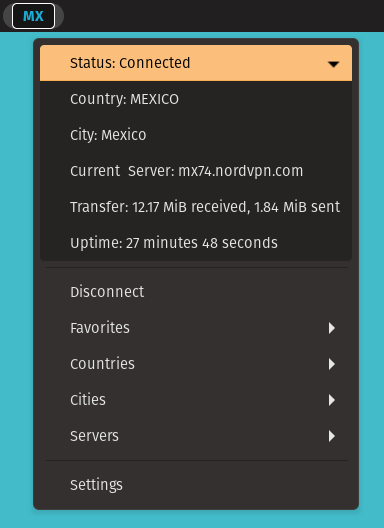

# gNordVPN-Local: GNOME Interface for NordVPN

## Overview

**gNordVPN-Local** is a GNOME Shell extension designed to provide seamless integration with NordVPN. Manage VPN connections directly from the GNOME top bar with intuitive menus and status indicators.

## Prerequisites

- NordVPN account and the NordVPN CLI tool installed
- GNOME Shell (version 42 and above)

## Features

- 🌐 **Quick Connect/Disconnect**: Toggle your VPN connection with a single click.
- 🌍 **VPN Server Status**: View your current connection status and server details.
- ⭐ **Favorites**: Easy access to your favorite servers.
- 🛠️ **Custom Panel Positioning**: Adjust the extension's panel position to left, center, or right.
- 🎨 **CSS Restyling**: Completely restyle the extension to your liking via CSS settings

## Installation
This extension uses the NordVPN command line client, which can be set up as follows.

### Install NordVPN
1. Install NordVPN with `sudo apt install nordvpn`.
2. Configure your credentials with `nordvpn login`, following the prompts.
3. Check NordVPN is set up with `nordvpn c`, if it connects successfully then you're good to go.

### Install the extension
#### Easiest way: 
Enable on gnome-extensions at [gNordVPN Local on gnome extensions](https://extensions.gnome.org/extension/2569/gnordvpn-local/)

#### Manual install:
1. Create a folder for the extension with `mkdir ~/.local/share/gnome-shell/extensions/gnordvpn-local@isopolito`
2. Copy the files from this repo into that folder
3. Enable the extension using `Tweaks` (if you don't have it, install via `sudo apt install gnome-tweaks`)

## Troubleshooting

If the extension shows an error state, make sure NordVPN CLI is functioning (`nordvpn status`). The extension relies on NordVPN CLI being operational. If any behavior suddenly changes, check `nordvpn` CLI to see if anything has changed there, sometimes they make breaking changes that need to be handled by the extension. Other times they have transient errors on their end that eventually clear up.

## Known Issues

When this extension is used in conjunction with **Dash to Panel**, the gNordVpn panel icon is unusually large. This can be fixed by manually changing the css styling in the settings, here:

As an example, one user who has Dash to Panel and gNordVpn used this css at the bottom in the **Common CSS** input: _font-weight: bold; border-radius: 20px; padding: 12px 11px 0; margin: 6px 0px 5px 05px;_

## Development

Contributions welcome! If you find any issues or think of any cool features, check to see if it's already documented under Issues, if not--raise it.

## Thanks

Thanks [TheRobVK](https://github.com/ThatRobVK) for creating the original version of this extension. Also thanks to all who have contributed, it's much appreciated!

## License

This project is licensed under the MIT License. See the [LICENSE](LICENSE) file for details.
