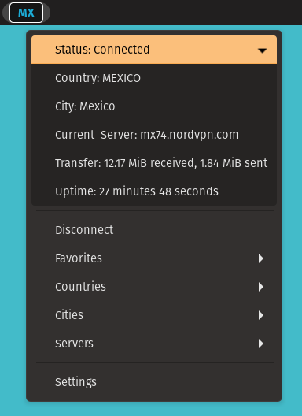

# gNordVPN-Local: GNOME Interface for NordVPN

## Overview

**gNordVPN-Local** puts NordVPN controls directly in the GNOME top bar. It uses the NordVPN CLI under the hood to show live connection state, surface quick actions, and expose the most useful NordVPN settings without leaving the desktop shell.

## Prerequisites

- A NordVPN account
- The NordVPN Linux CLI installed and working
- GNOME Shell 42 or newer

## Features

- 🖥️ **Top-bar control**: Connect, disconnect, and inspect NordVPN status from the GNOME panel.
- 📡 **Live status display**: See connection state, country, and server details at a glance.
- 🌍 **Fast server selection**: Browse and connect by country, city, or server.
- ⭐ **Favorites**: Pin commonly used countries, cities, and servers for quicker access.
- ⚙️ **Connection preferences**: Configure options such as auto-connect, protocol, and technology from the extension settings.
- 🧭 **Panel customization**: Move the indicator to the left, center, or right side of the top bar.
- 🎨 **Style overrides**: Complete customization using CSS for the different VPN states.

## Installation
This extension uses the NordVPN command line client, which can be set up as follows.

### Install NordVPN
1. Install NordVPN with `sudo apt install nordvpn`.
2. Configure your credentials with `nordvpn login`, following the prompts.
3. Check NordVPN is set up with `nordvpn c`, if it connects successfully then you're good to go.

### Install the extension
#### Easiest way: 
Enable on gnome-extensions at [gNordVPN Local on gnome extensions](https://extensions.gnome.org/extension/2569/gnordvpn-local/)

#### Manual install:
1. Create a folder for the extension with `mkdir ~/.local/share/gnome-shell/extensions/gnordvpn-local@isopolito`
2. Copy the files from this repo into that folder
3. Enable the extension using `Tweaks` (if you don't have it, install via `sudo apt install gnome-tweaks`)

## Troubleshooting

If the extension shows an error state, make sure NordVPN CLI is functioning (`nordvpn status`). The extension relies on NordVPN CLI being operational. If any behavior suddenly changes, check `nordvpn` CLI to see if anything has changed there, sometimes they make breaking changes that need to be handled by the extension. Other times they have transient errors on their end that eventually clear up.

## Known Issues

When this extension is used in conjunction with **Dash to Panel**, the gNordVpn panel icon is unusually large. This can be fixed by manually changing the css styling in the settings, here:

As an example, one user who has Dash to Panel and gNordVpn used this css at the bottom in the **Common CSS** input: _font-weight: bold; border-radius: 20px; padding: 12px 11px 0; margin: 6px 0px 5px 05px;_

## Bug Reports

Please raise an issue with the following data points:
  1. Version of gnome: `gnome-shell --version`
  2. Version of nordvpn: `nordvpn --version`
  3. Version the gNordVpn extension
  4. Screenshots of the problem if applicable
  5. Steps to reproduce the issue

## Development

Contributions welcome! If you find any issues or think of any cool features, check to see if it's already documented under Issues, if not--raise it.

## Thanks

Thanks [TheRobVK](https://github.com/ThatRobVK) for creating the original version of this extension. Also thanks to all who have contributed, it's much appreciated!

## License

This project is licensed under the MIT License. See the [LICENSE](LICENSE) file for details.
